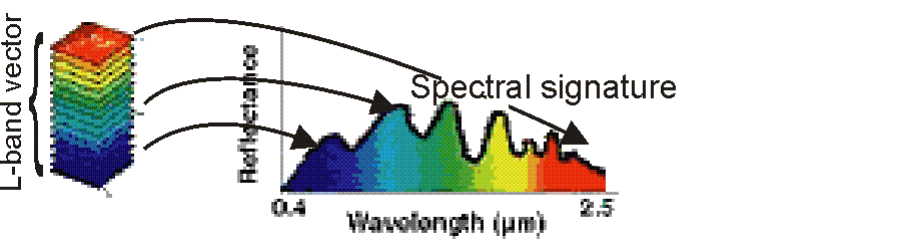

# Hyperspectral Images (HSI) processing

## General Information
**Hyperspectral images (HSIs):** An HSI depicts a specific scene at several (L) narrow 
continuous spectral bands (actually, they visualize the reflectance of the depicted scene 
in various spectral bands). It can be represented by a MxNxL three-dimensional cube, 
where the first two dimensions correspond to the spatial information, while the third 
corresponds to the spectral information. Thus, the (i,j) pixel in such an image, i=1,…,M, 
j=1,…,N, is represented by an L-dimensional vector (constituted by the corresponding 
spectral bands), called the ***spectral signature*** of the pixel.

In several remote sensing applications, the HSIs (taken from satellites) that depict 
specific scenes of the earth surface at a specific spatial resolution (that is, a single pixel 
may represent an area from 3x3 m2, to, e.g., 100x100m2 or more). That is, each pixel is 
likely to depict more than one materials depicted in the corresponding area of the 
scene. Such pixels are called ***mixed pixels*** and they are the vast majority of the pixels in 
the image. On the other hand, there are (usually) a few pixels that depict a single 
material. These are called ***pure pixels***. 

### Processing in HSIs
The usual processing procedures in HSIs follow two main directions, 
namely, the spectral unmixing and the classification (supervised, unsupervised). In our occasion we will follow the spectral unmixing method.

### Spectral Unmixing (SU)
The problem here is stated as follows: Assume that a set of 
m spectral signatures corresponding to the pure pixels in the HSI under study is 
given. For a given pixel in the image, the aim is to determine the percentage 
(abundance) to which each pure material contributes in its formation. It is clear, 
that SU provides sub-pixel information for a given pixel. Speaking in mathematical 
terms, let  
* ***y:*** be the (column L-dimensional) spectral signature of the pixel under study
* ***x1,…,xm:*** be the spectral signatures (column L-dimensional vectors) of the pure 
pixels in the image (each one corresponding to a pure material met in the 
image)
* ***θ:*** be the m-dimensional abundance vector of the pixel (its q-th coordinate 
corresponds to the percentage to which the q-th pure pixel contributes to the 
formation of the pixel under study).  

Adopting the linear spectral unmixing hypothesis, the above quantities are related 
as follows:  

<h4>
<b>y = Xθ + η</b>
</h4>

where η is an L-dimensional i.i.d., zero mean Gaussian noise vector. Note that, 
physically, the entries of θ should be nonnegative and (ideally) they should sum to 
one. 

## About the project
All questions in this project refer to the so called “Salinas” HSI, which depicts an area of 
the Salinas valley in California, USA. It is a 220x120 spatial resolution HSI and consists of 
204 spectral bands (from 0.2μm – 2.4μm) and its spatial resolution is 3.7m (that is, the 
HSI is a 220x120x204 cube). The data that will be used are in the files 
***“Salinas_cube.mat”*** (the Salinas hypercube) and ***“Salinas_gt.mat”*** (the class label for 
each pixel). 

<h4>
<b>!!!Only the pixels with nonzero class label will be taken into consideration in this 
project!!!!</b>
</h4>

### Endmembers
The “Salinas” HSI includes 7 endmembers, each one corresponding to a certain material 
(cultivation in our case), as described in the following table: 

| Endmember | Material  |
|  :------: |  :-----:  |
| 1         | Grapes    |
| 2         | Broccoli  |
| 3         | Fallow 1  |
| 4         | Fallow 2  |
| 5         | Fallow 3  |
| 6         | Stubble   |
| 7         | Celery    |

 The aim here is to perform ***unmixing*** on each one of the ***pixels in the image with 
nonzero label***, with respect to the 7 endmembers using the following five different spectral unmixing methods: 

* Least squares
* Least squares imposing the sum-to-one constraint 
* Least squares imposing the non-negativity constraint on the entries of θ 
* LASSO, i.e., impose sparsity on θ via 𝑙1 norm minimization

